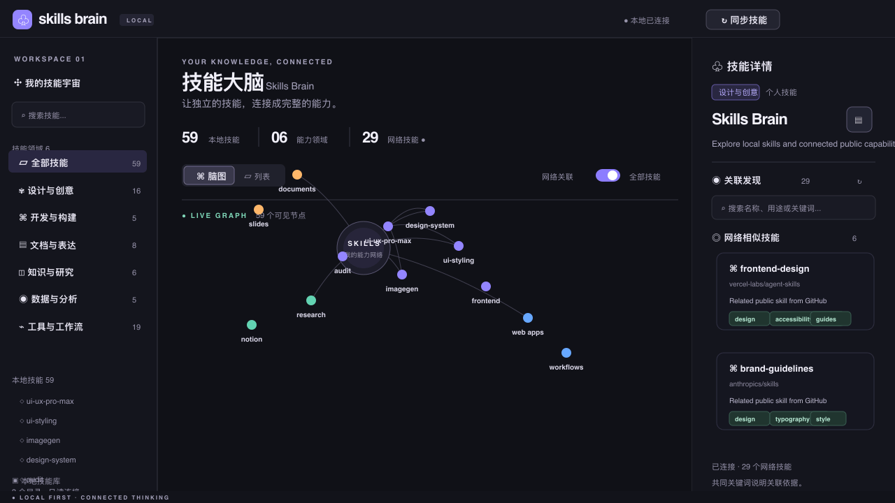

<div align="center">

# Skills Brain

**Connect scattered Agent Skills into an explorable capability graph.**

Local-first · Interactive graph · Related skills · Source reader

**English** | [简体中文](README.zh-CN.md)

[Quick start](#quick-start) · [Codex integration](#codex-integration) · [Features](#features) · [Configuration](#configuration) · [Contributing](CONTRIBUTING.md)

</div>



Skills Brain is a local skill browser. It reads your `SKILL.md` files, groups them by purpose, and finds related capabilities in public GitHub skill repositories. Use it to organize your library, understand what each skill does, and discover alternatives.

**No API key. No database. Local skill content is not uploaded.**

The application interface is currently in Simplified Chinese. This README documents the existing application; English UI localization is not yet included.

## Features

| Capability           | How it works                                                                                                                     |
| -------------------- | -------------------------------------------------------------------------------------------------------------------------------- |
| Local discovery      | Scan personal, system, and plugin-cache directories; deduplicate by content hash; refresh with Sync skills                       |
| Six capability areas | Design & creativity, development & building, documents & communication, knowledge & research, data & analysis, tools & workflows |
| Interactive graph    | Focus a category cluster, highlight parent nodes, or isolate a selected skill                                                    |
| Navigation           | Drag to pan, double-click repeatedly to zoom in, pinch on a trackpad or touchscreen, and use zoom/reset controls                 |
| List filtering       | Search names and descriptions; selecting a skill filters the list to it; dismiss the selected-name chip to clear the selection   |
| Collapsible sidebar  | Use the header button, click the sidebar edge, or drag it left/right; icons remain visible when collapsed                        |
| Folder shortcuts     | Open a skill's containing folder from its sidebar entry                                                                          |
| Source reader        | Open the document icon next to the skill name for a separate, keyboard-accessible reading dialog                                 |
| Related skills       | Match names, descriptions, and categories; inspect GitHub sources and shared-keyword tags                                        |
| Resizable inspector  | Drag the divider to resize the desktop inspector, with a 300px minimum; skill details stay fixed while related results scroll    |
| Keyboard and motion  | Select graph nodes and adjust dividers with the keyboard; node animation respects reduced-motion preferences                     |

## Quick start

### Requirements

- **Node.js 22.13 or later**. A maintained LTS release is recommended.
- npm, included with Node.js, and Git. Git is optional if you download a ZIP.
- macOS, Windows, or Linux with a graphical desktop. Folder shortcuts use `open`, `explorer.exe`, and `xdg-open`, respectively. Development validation has been performed on macOS.

### Option 1: Clone the repository

```sh
git clone https://github.com/YuY-QK/skills-brain.git
cd skills-brain
npm ci
npm start
```

Open **[http://127.0.0.1:5173](http://127.0.0.1:5173)**. Keep the terminal running while you use the app. Press `Ctrl+C` to stop it.

### Option 2: Download a ZIP

1. [Download the main branch ZIP](https://github.com/YuY-QK/skills-brain/archive/refs/heads/main.zip), or select **Code → Download ZIP** on GitHub.
2. Extract it and open a terminal in the directory containing `package.json`.
3. Run `npm ci`, then `npm start`.
4. Open the local address.

This is a source-installed local application. Standalone desktop installers and an npm registry package are not currently provided.

### Guided setup for Codex

After cloning and running `npm ci`, register the bundled Skill and local MCP server:

```sh
npm run setup
```

Restart Codex after setup. Diagnose the installation with `npm run doctor`. The installer refuses to overwrite a skill directory it did not create.

Choose either this setup method or the marketplace method below. Installing both creates duplicate `skills-brain` entries.

### One-paste Codex installation

For a Codex-only setup, the bundled marketplace is the fastest path. Paste this single command into a terminal, then restart Codex:

```sh
codex plugin marketplace add YuY-QK/skills-brain --ref main && codex plugin add skills-brain@skills-brain-marketplace
```

This installs the bundled Skill and the read-only local MCP server from the plugin cache; a separate source checkout is not needed.

### Updating

Stop the server, preserve any personal configuration changes, then run:

```sh
npm run update
```

If you have edited the source, commit or back up your changes before updating.

To remove the managed Skill and MCP registration while keeping the application checkout:

```sh
npm run uninstall
```

This command removes only the guided-setup installation. A marketplace-installed plugin is managed with `codex plugin remove skills-brain@skills-brain-marketplace`.

## Codex integration

Version 0.3 includes a read-only local MCP server. Once `npm run setup` has registered it and Codex has restarted, Codex can use five tools without requiring the graph page to be open:

| Tool                    | Purpose                                                              |
| ----------------------- | -------------------------------------------------------------------- |
| `skills_catalog_status` | Count discovered skills, inspect categories, roots, and scan errors  |
| `skills_search`         | Search local skill metadata by task, capability, category, or source |
| `skills_get`            | Inspect one local skill; full source is opt-in                       |
| `skills_compare`        | Compare two to five local skills and show shared keywords            |
| `skills_recommend`      | Recommend local and optional public candidates for a concrete task   |

Example prompts:

> Search my installed skills for building an accessible dashboard.

> Compare ui-ux-pro-max and ui-styling, then recommend which one fits a React admin page.

> 为“分析财务表格并制作汇报”推荐本地技能，并说明使用顺序。

Recommendations use deterministic keyword/category heuristics. Codex can interpret the returned candidates and create a task-specific plan, but results do not activate or install skills automatically.

The repository is also a Codex plugin package through [`.codex-plugin/plugin.json`](.codex-plugin/plugin.json), combining the bundled Skill and MCP server. The `npm run setup` path is the most predictable installation method for the current source release.

Alternatively, install it through the repository marketplace without running `npm run setup`:

```sh
codex plugin marketplace add YuY-QK/skills-brain --ref main
codex plugin add skills-brain@skills-brain-marketplace
```

Restart Codex after installation. Use `codex plugin marketplace upgrade skills-brain-marketplace` to fetch a newer marketplace snapshot, then reinstall the plugin through Codex. The plugin package contains its own MCP runtime files, so it works from Codex's plugin cache without the source checkout.

## Install as an Agent Skill

The repository includes a standard [`SKILL.md`](SKILL.md) that guides a compatible agent through installing, launching, and using Skills Brain. **Installing the skill instructions does not automatically install or start the web application.**

For manual installation, copy `SKILL.md` into a `skills-brain/` subdirectory of your agent's skill directory. For example, from the repository directory on macOS or Linux:

```sh
mkdir -p ~/.agents/skills/skills-brain
cp SKILL.md ~/.agents/skills/skills-brain/SKILL.md
```

If your agent uses another skill location, change the destination accordingly. Once the skill is loaded, try:

> Use skills-brain to open my local skill graph and find related design skills.

Install the application separately using the quick-start steps above. Do not copy `node_modules` into your skill directory.

The instruction-only installation can guide launching and browsing, but it does not expose the five MCP tools. Use `npm run setup` for the complete v0.3 integration.

## Configuration

Configuration currently lives in [`server/skills.mjs`](server/skills.mjs). The local development server reloads when this file changes.

### Local directories

The default scan roots are relative to the current user's home directory:

```text
~/.agents/skills
~/.codex/skills
~/.codex/plugins/cache
```

Edit the `roots` array to add another agent's skill directory or a project directory, such as `path.join(homedir(), '.claude/skills')`. Avoid scanning an entire home directory containing unrelated files.

Scanning is limited to nine nested levels and skips directories such as `.git`, `node_modules`, `references`, `scripts`, and `assets`. Plugin caches may contain inactive skills, so discovered files do not necessarily represent the skills enabled in an agent session. Identical content is deduplicated, retaining the first discovered path. The scanner currently does not follow directory symlinks.

### Public repositories

Default sources:

- [anthropics/skills](https://github.com/anthropics/skills)
- [vercel-labs/agent-skills](https://github.com/vercel-labs/agent-skills)

Edit the `repositories` array using `owner/repository` entries. The current implementation reads the `main` branch, with a maximum of 60 `SKILL.md` files per repository. Results are cached in process memory for one hour; restarting clears the cache. The refresh button reuses results while the cache is valid.

Matching uses **English keyword overlap plus a same-category bonus**. It is not an embedding model or a search across the entire web. Shared keywords explain the match; they do not imply quality ratings or security endorsements. Candidates below the matching threshold are omitted.

### Port

The default port is 5173. If it is occupied:

```sh
npm run dev -- --port 5174
```

Use the address printed in the terminal. The server listens only on `127.0.0.1`; do not expose it to the public internet.

## Data and permissions

- Local skill files are read-only. The app does not install, modify, or execute skills.
- Local names, descriptions, and source content are served to your browser through a local endpoint, not uploaded to GitHub.
- Network requests download public repository trees and skill files from the configured sources. GitHub receives normal request information, such as your IP address.
- Folder shortcuts accept only IDs found in the local scan. The directory is passed to the operating system's file manager as a separate argument; arbitrary paths and shell commands are not accepted.
- Opening a folder requires a same-origin JSON POST. Local read endpoints reject cross-origin requests.
- External source links navigate to the corresponding GitHub page.

## Troubleshooting

**No local skills found?** Check that `roots` points to your actual skill directories and files are named `SKILL.md`, then sync again. Missing or unreadable directories are reported in the bottom status bar.

**No remote skills, or only partial results?** Check your network connection. Anonymous GitHub API requests are rate-limited; try refreshing later. Local browsing remains available offline.

**Folder shortcut does not work?** Read the on-screen error. Linux requires a graphical desktop and `xdg-open`. File-manager launching is not guaranteed in SSH, containers, or headless environments.

**Lost your place after zooming?** Click the circular-arrow Reset view button in the lower-right corner. The × on the selected-name chip clears skill/category filtering.

**Can this run in the cloud?** The current version depends on the local filesystem and desktop capabilities. `npm run build` validates frontend compilation; it does not produce a cloud service that can scan your computer. Use `npm start` for the complete local application.

## Development

```sh
npm ci
npm run dev
npm run typecheck
npm test
npm run build
```

Core structure:

```text
app/page.tsx             Graph, selection state, panels, and gestures
app/globals.css          Theme, layout, and animation
server/skills.mjs        Scanner, public-source fetching, local endpoints, folder launching
server/mcp.mjs           Read-only stdio MCP server for Codex
scripts/manage.mjs       Setup, update, diagnostics, and uninstall lifecycle
server/*.test.mjs        Scanner, matching, folder-launch, and MCP protocol tests
components/ui/          Accessible interface primitives
skills/skills-brain/    Plugin-bundled Agent Skill
SKILL.md                Standalone Agent Skill entry point
```

Built with React 19, TypeScript, Vinext / Vite, Tailwind CSS, Base UI, Lucide, and react-resizable-panels. Browser interactions and platform-specific file-manager behavior should still be verified on your target devices.

## CI template

[`docs/ci-workflow.yml`](docs/ci-workflow.yml) includes dependency installation, type checking, tests, and a build. It is not enabled yet: the token used for the initial push lacked GitHub's `workflow` permission. A maintainer with sufficient access can copy it to `.github/workflows/ci.yml` and commit it to enable GitHub Actions.

## Contributing and license

Report problems through [Issues](https://github.com/YuY-QK/skills-brain/issues), or see [CONTRIBUTING.md](CONTRIBUTING.md) for contribution instructions (currently in Chinese).

This project is licensed under the [MIT License](LICENSE). Dependencies and remote skills retain their own licenses. This repository does not redistribute your local skills or remote skill bodies.
